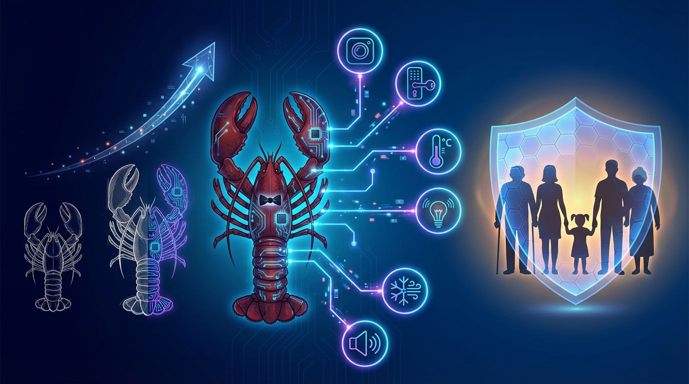

<p align="center">
  
</p>

<h1 align="center">🦞🐝 LobsterHive</h1>
<p align="center"><strong>蜂群智能守护家庭 — Swarm Intelligence meets Smart Home</strong></p>
<p align="center">一群 AI 蜜蜂守护一个家，一只龙虾统筹一切。</p>

<p align="center">
  <a href="https://xiaofengshi.github.io/lobster_home/">🌐 在线主页</a> ·
  <a href="https://xiaofengshi.github.io/lobster_home/#dashboard">📊 实时仪表盘</a> ·
  <a href="https://feishu.cn/docx/LDksdHQfAo7z99xNiXmc6BShncd">📄 设计文档</a>
</p>

---

## 它是什么

**LobsterHive** 是一个基于蜂群智能（Swarm Intelligence）的多 Agent 智能家居系统。不是一个大模型做所有事，而是 **5 只专业蜜蜂 + 1 只蜂后**，各司其职守护你的家。

> 蜜蜂用摇摆舞传递食物方向和距离 → 我们用 JSON 事件传递结构化数据。

## 🐝 蜂群矩阵

| 蜜蜂 | 角色 | 职责 | 成本 |
|------|------|------|------|
| 👑🦞 **蜂后 Alan** | Queen | 总调度——不干活，只指挥 | - |
| 🔭 **侦查蜂** | Scout | 摄像头截图 + VLM 视觉分析 + 传感器 + 天气 | 大型视觉模型 |
| ⚔️ **守卫蜂** | Guard | 纯规则引擎安全检测（摔倒/火灾/入侵） | **¥0 · <1ms · 100%** |
| 💊 **哺育蜂** | Nurse | 个性化天气关怀、课前提醒、到家通知 | 轻量 LLM |
| 💃 **舞蹈蜂** | Dancer | 统一通知出口（飞书 + 音箱），去重 + 静音 | ¥0 |
| 📖 **筑巢蜂** | Builder | 指纹学习、行为统计、知识持久化 | 轻量 LLM |

**日成本 ≈ ¥4.35** — 只有"看"需要大模型，其他全是规则引擎或轻量推理。

## ⚡ 核心亮点

### 🎯 摇摆舞 = 事件总线

蜜蜂之间通过结构化 JSON 事件通信，实现完全解耦：

```
门锁触发 → 侦查蜂发布 door_unlock 事件
         → 守卫蜂检测：已知指纹 + 合理时段 → ✅ 安全
         → 哺育蜂推理：17:17 = 接小宝回来 → 生成关怀消息
         → 舞蹈蜂通知：飞书 "小宝到家啦！🎒" + 音箱播报
         → 筑巢蜂记录：今日到家17:17（比平时早5分钟）
```

### 🛡️ 零成本安全层

守卫蜂用**纯规则引擎**——关键词匹配 + 否定语境排除。安全这件事不交给概率模型。

- ⏱️ **<1ms** 延迟
- 💰 **¥0** 成本
- ✅ **100%** 确定性

### 🧬 零配置指纹学习

VLM 视觉特征 + 门锁指纹 ID 交叉验证。3 次一致 = 自动确认身份。不需要任何手动配置。

### 🏥 蜂巢自愈

- 蜜蜂连续 3 次失败 → 自动重置 + 飞书通知管理员
- 30 天未运行 → 自动休眠
- 全局状态机：normal / away / sick / storm_alert

## 📊 关键指标

| 指标 | 数值 |
|------|------|
| HA 实体 | **166** |
| 传感器 | **28** |
| 完整巡查耗时 | **~9 秒** |
| 代码量 | **~3900 行** |
| 安全检测延迟 | **<1ms** |
| 已认识家人 | **8** |
| 观察记录 | **200+** |

## 🏠 实际场景

**🌅 晨间播报** — 起床后自动播天气、穿衣建议、今日课程

**📬 口述提醒** — "明天下午3点周会"，到点飞书+音箱双通道提醒

**👶 课前提醒** — 周一三体能课、周二四六英语课，提前 30 分钟自动提醒

**🔑 到家检测** — 门锁指纹识别，个性化欢迎（姥姥接小宝回来 vs 晓峰下班）

**🌙 晚间收尾** — 检查门锁、灯光、温度，生成今日活动总结

**⛈️ 暴雨联动** — 天气预警自动触发关怀通知 + 调整巡查策略

## 🔒 隐私承诺

| 规则 | 说明 |
|------|------|
| 🌙 20:00后摄像头休眠 | 家人隐私保护，不可覆盖 |
| 🔐 用户关闭 = 绝对不开 | AI 不自行重启任何被关闭的设备 |
| 🏠 家人在家 = 永远正常 | 不当考勤机，不发"异常行为"告警 |
| 🤫 22:00后全系统静音 | 紧急事件除外 |

## 🏗️ 架构

```
┌─────────────────────────────────────────┐
│              👑 蜂后 Queen               │
│         （编排调度，不干活）              │
└───────┬─────┬─────┬─────┬─────┬────────┘
        │     │     │     │     │
   ┌────▼──┐ ┌▼───┐ ┌▼──┐ ┌▼──┐ ┌▼────┐
   │🔭Scout│ │⚔️  │ │💊 │ │💃 │ │📖   │
   │侦查蜂 │ │Guard│ │Nrs│ │Dnc│ │Build│
   └───┬───┘ └──┬──┘ └─┬─┘ └─┬─┘ └──┬──┘
       │        │      │     │      │
   ┌───▼────────▼──────▼─────▼──────▼───┐
   │         💃 摇摆舞事件总线           │
   │      (JSON events / JSONL 持久化)   │
   └─────────────────────────────────────┘
```

## 技术栈

| 层 | 技术 |
|----|------|
| AI 引擎 | [OpenClaw](https://openclaw.ai) |
| 视觉理解 | 大型视觉语言模型 (VLM, 235B) |
| 关怀/编排 LLM | 轻量语言模型 (轻量推理) |
| 安全检测 | 纯规则引擎 (零模型依赖) |
| 智能家居 | Home Assistant + 米家 |
| 通知 | 飞书 API + 小爱音箱 TTS |
| 语音 | Edge-TTS (中文) + Opus 编码 |
| 日志 | 按天轮转 logging + JSONL 事件流 |
| 部署 | macOS + launchd (每5分钟) |

### 🤖 模型清单

| 模型 | 类型 | 用途 | 调用频率 |
|------|------|------|---------|
| **VLM** | 大型视觉语言模型 (235B) | 摄像头截图理解、人员识别 | 每5分钟 |
| **LLM** | 轻量语言模型 | 天气关怀生成、晚间总结 | 按需 |
| **TTS** | 文本转语音引擎 | 音箱中文播报 | 按需 |
| **规则引擎** | 无模型 | 安全检测、到家检测 | 实时 |

## 📁 项目结构

```
lobster-home/
├── queen.py              # 👑 蜂后编排器
├── bees/                  # 🐝 蜜蜂模块
│   ├── scout.py           # 🔭 侦查蜂 (665行)
│   ├── guard.py           # ⚔️ 守卫蜂 (214行)
│   ├── nurse.py           # 💊 哺育蜂 (620行)
│   ├── dancer.py          # 💃 舞蹈蜂 (552行)
│   └── builder.py         # 📖 筑巢蜂 (428行)
├── hive/                  # 🏠 蜂巢核心
│   ├── config.py          # 统一配置
│   ├── event_bus.py       # 摇摆舞事件总线
│   ├── hive_state.py      # 全局状态机
│   ├── hive_health.py     # 健康监控
│   ├── bee_base.py        # 蜜蜂基类
│   ├── safe_io.py         # 原子文件操作
│   ├── retry.py           # 指数退避重试
│   └── logger.py          # 日志框架
├── dashboard/             # 📊 可视化仪表盘
│   ├── collect_data.py    # 数据收集
│   └── data.json          # 实时数据
├── honey/                 # 🍯 蜂蜜报告
├── data/                  # 运行时数据
└── index.html             # 🌐 主页 + 仪表盘
```

## 快速开始

```bash
# 1. 克隆
git clone https://github.com/xiaofengShi/lobster_home.git
cd lobster_home

# 2. 配置环境变量
cp .env.example .env.local
# 填写: HA_URL, HA_TOKEN, FEISHU_APP_ID, FEISHU_APP_SECRET, KSC_API_KEY

# 3. 运行
python3 queen.py          # 单次巡查
python3 -c "from queen import run_all; run_all()"  # 完整流程

# 4. 查看仪表盘
python3 -m http.server 8765
# 打开 http://localhost:8765
```

---

<p align="center">
  <em>让技术有人情味，这就是 LobsterHive 的核心竞争力。</em>
</p>
<p align="center">
  <em>Powered by <a href="https://openclaw.ai">OpenClaw</a> · Built by 晓峰 & 🦞Alan</em>
</p>
